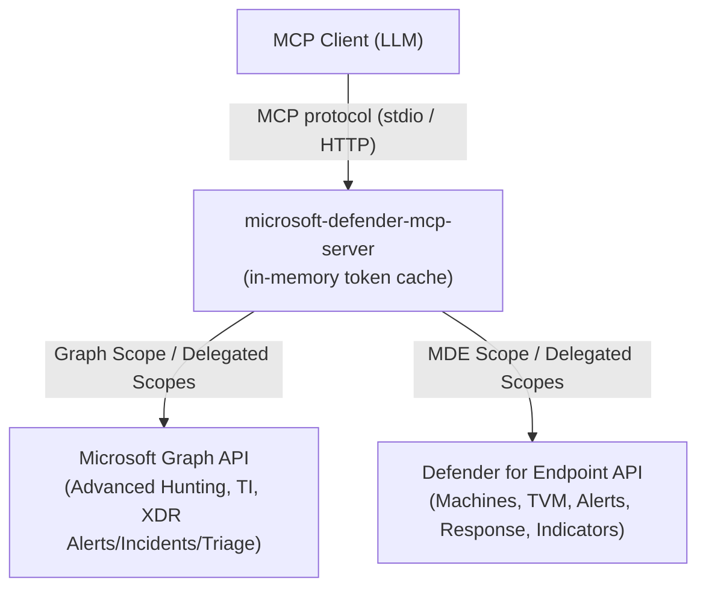

# Microsoft Defender MCP Server

A [Model Context Protocol (MCP)](https://modelcontextprotocol.io/) server for security investigation, threat intelligence, vulnerability management, and response workflows across Microsoft Defender XDR and Microsoft Defender for Endpoint (MDE).

Built in Rust with the official [`rmcp`](https://crates.io/crates/rmcp) SDK (v3), the server exposes Microsoft Graph Security and Defender for Endpoint APIs through a domain-oriented catalog of up to 10 action-based tools:

- **6 read-only tools** (always exposed): `defender_hunting`, `defender_ti`, `defender_incidents_alerts`, `defender_machines`, `defender_vulnerabilities`, `defender_forensics`.
- **4 mutating tools** (disabled by default, gated by explicit category flags):
  - `defender_response`: Live Response commands, library files, investigation packages, file quarantine (`--enable-live-response`).
  - `defender_device_response`: device containment, scans, tags, machine actions (`--enable-device-response`); device offboarding additionally requires `--enable-offboarding`.
  - `defender_indicators`: custom indicator management and batch operations (`--enable-indicators`).
  - `defender_triage`: alert and incident status, classification, assignment, and comments (`--enable-triage`).

`--read-only` hides every mutating tool from `tools/list` and rejects calls locally before any upstream request.

> **Security warning**
> Mutating response tools can isolate endpoints, terminate processes, modify firewall rules, run scripts, manage custom block indicators, and alter security alerts. Destructive tools require interactive human confirmation via MCP elicitation unless explicitly disabled for automated workflows (`--disable-human-confirmation`).
> `defender_forensics` downloads investigation packages and retrieved files to the local quarantine directory. Files are written with mode `0600` and never executed; analyze them only in an isolated environment.
> The HTTP transport has no built-in TLS or client authentication. Binding beyond `127.0.0.1` requires an authenticated reverse proxy, VPN, or equivalent trusted network boundary. Over HTTP in user authentication mode, all connected clients act with the signed-in user's privileges.
---

## Capabilities & Tool Summary

The server implements **10 domain-oriented action tools** partitioned across two upstream API scopes:



### Tool Catalog & Enablement Gating

| # | Tool | Kind | Listed when | Annotations (`readOnly` / `destructive`) | Key Actions |
|---|------|------|-------------|------------------------------------------|-------------|
| 1 | `defender_hunting` | Read-only | Always | `true` / `false` | `run` (KQL queries) |
| 2 | `defender_ti` | Read-only | Always | `true` / `false` | 39 TI lookups (profiles, articles, hosts, SSL, WHOIS, CVEs), plus `custom_indicator_list` |
| 3 | `defender_incidents_alerts` | Read-only | Always | `true` / `false` | `xdr_alert_*`, `xdr_incident_*`, `endpoint_alert_*`, `*_related_alerts` |
| 4 | `defender_machines` | Read-only | Always | `true` / `false` | `machine_*`, `find_by_tag`, `find_by_ip`, `machine_alerts`, `machine_vulnerabilities`, `machine_missing_kbs`, statistics |
| 5 | `defender_vulnerabilities` | Read-only | Always | `true` / `false` | `software_*`, `vulnerability_*`, `recommendation_*`, `remediation_*`, `exposure_score` |
| 6 | `defender_forensics` | Read-only | Always | `true` / `false` | `machine_action_*`, `get_investigation_package_sas_url`, `download_*`, `investigation_*`, `library_file_list`, `live_response_get_result` |
| 7 | `defender_response` | Mutating | `--enable-live-response` | `false` / `true` | `collect_investigation_package`, `stop_and_quarantine_file`, `live_response_run`, `upload_library_file`, `library_file_delete` |
| 8 | `defender_device_response` | Mutating | `--enable-device-response` | `false` / `true` | `isolate`, `unisolate`, `restrict_app_execution`, `unrestrict_app_execution`, `run_av_scan`, `start_investigation`, `cancel_machine_action`, `tag_add`, `tag_remove`, `set_device_value`, `offboard` (requires `--enable-offboarding`) |
| 9 | `defender_indicators` | Mutating | `--enable-indicators` | `false` / `true` | `submit` (create/update), `delete`, `batch_delete` |
| 10 | `defender_triage` | Mutating | `--enable-triage` | `false` / `false` | `endpoint_alert_update`, `endpoint_alert_batch_update`, `endpoint_alert_comment`, `xdr_alert_update`, `xdr_alert_comment`, `xdr_incident_update`, `xdr_incident_comment` |

Under `--read-only`, tools 7–10 are hidden from `tools/list` and rejected locally.

> **Authoritative Schemas:**
> Every tool publishes its complete JSON schema, parameter constraints, and security annotations via the standard MCP `tools/list` protocol endpoint.
---

## Authentication & Entra ID Permissions

The server supports two authentication modes via `--auth-mode <app|user>`:

1. **Application Authentication (`--auth-mode app`, default)**:
   - Uses Entra ID OAuth 2.0 `client_credentials`.
   - Requires `AZURE_TENANT_ID`, `AZURE_CLIENT_ID`, and `AZURE_CLIENT_SECRET`.
   - Requests audience scopes `{audience}/.default` (`https://graph.microsoft.com/.default` and `https://api.securitycenter.microsoft.com/.default`).

2. **Delegated User Sign-In (`--auth-mode user`)**:
   - Uses interactive browser sign-in with PKCE (OAuth 2.0 authorization code flow) or device code flow fallback (`--sign-in-flow <auto|browser|device-code>`).
   - Requires `AZURE_TENANT_ID` and `AZURE_CLIENT_ID`. `AZURE_CLIENT_SECRET` is **ignored and never read**.
   - **Prerequisites for Public Client App Registration**:
     - In Entra ID App Registrations, under **Authentication**, register a Mobile and desktop applications redirect URI: `http://localhost` (or enable "Allow public client flows" under Advanced settings).
     - Grant admin consent or user consent for required delegated permissions.
   - Performs sign-in at server startup before any MCP requests are accepted.
   - Token scopes are requested dynamically based on enabled categories (under `--read-only`, no write-named scopes are requested).
   - Tokens and refresh tokens are cached strictly in memory; no credential material is ever written to disk or the OS keychain.
   - Refreshes tokens silently in the background before expiry using single-flight synchronization.

> **Security Notice for HTTP Transport in User Mode:**
> When using `--transport http` with `--auth-mode user`, every connected MCP client shares the single authenticated identity established at startup. For per-analyst attribution, run one server instance per analyst bound to localhost or isolated network namespaces.

### Permission Matrix

| Category | Application Permission (`--auth-mode app`) | Delegated Scope (`--auth-mode user`) | Defender Role Permission (User Mode) |
|---|---|---|---|
| **Read (Endpoint)** | `Machine.Read.All`, `Alert.Read.All`, `Vulnerability.Read.All`, `Software.Read.All`, `SecurityRecommendation.Read.All`, `Score.Read.All`, `RemediationTasks.Read.All`, `User.Read.All` | Corresponding `*.Read` scopes, plus `User.Read.All` | View data |
| **Read (Graph)** | `ThreatHunting.Read.All`, `ThreatIntelligence.Read.All`, `SecurityAlert.Read.All`, `SecurityIncident.Read.All` | Same names (delegated) | Entra Security Reader, or Defender Unified RBAC role with equivalent read |
| **Reads Needing Write-Named Scopes** | `Machine.ReadWrite.All`, `Alert.ReadWrite.All`, `Ti.ReadWrite.All`, `Library.Manage` | `Machine.ReadWrite`, `Alert.ReadWrite`, `Ti.ReadWrite`, `Library.Manage` (not requested under `--read-only`) | View data |
| **Live Response (`defender_response`)** | `Machine.LiveResponse`, `Machine.CollectForensics`, `Machine.StopAndQuarantine`, `Library.Manage` | Same names | Live response capabilities; Alerts investigation; Active remediation actions |
| **Device Response (`defender_device_response`)** | `Machine.Isolate`, `Machine.RestrictExecution`, `Machine.Scan`, `Machine.ReadWrite.All`, `Alert.ReadWrite.All` | `Machine.Isolate`, `Machine.RestrictExecution`, `Machine.Scan`, `Machine.ReadWrite`, `Alert.ReadWrite` | Active remediation actions (isolate, restrict, scan, investigate); Manage security settings (tags, device value) |
| **Offboarding (`defender_device_response` `offboard`)** | `Machine.Offboard` | `Machine.Offboard` | Turn off capabilities / offboard |
| **Indicators (`defender_indicators`)** | `Ti.ReadWrite.All` | `Ti.ReadWrite` | Active remediation actions (manage indicators) |
| **Triage (`defender_triage`)** | `Alert.ReadWrite.All`, `SecurityAlert.ReadWrite.All`, `SecurityIncident.ReadWrite.All` | `Alert.ReadWrite`, `SecurityAlert.ReadWrite.All`, `SecurityIncident.ReadWrite.All` | Alerts investigation; Entra Security Operator |

### Per-Action Upstream Permission Requirements

- **`defender_hunting`**:
  - `run`: `ThreatHunting.Read.All` (Graph). Upstream limits: 100,000 rows, 50 MB payload, ~3-minute timeout.
- **`defender_ti`**:
  - Intel profiles, articles, host infrastructure, SSL certs, WHOIS, DNS, CVE vulnerabilities: `ThreatIntelligence.Read.All` (Graph; requires active Defender TI license).
  - `custom_indicator_list`: `Ti.ReadWrite` (MDE). Not requested in user mode under `--read-only`.
- **`defender_incidents_alerts`**:
  - `xdr_alert_list`, `xdr_alert_get`: `SecurityAlert.Read.All` (Graph).
  - `xdr_incident_list`, `xdr_incident_get`: `SecurityIncident.Read.All` (Graph).
  - `endpoint_alert_list`, `endpoint_alert_get`, `ip_related_alerts`, `domain_related_alerts`, `user_related_alerts`: `Alert.Read.All` (MDE; `Alert.ReadWrite.All` also accepted).
  - `file_related_alerts`: `Alert.ReadWrite.All` (MDE).
- **`defender_machines`**:
  - `machine_list`, `machine_get`, `find_by_tag`: `Machine.Read.All` (MDE).
  - `logged_on_users`, `user_related_machines`: `User.Read.All` (MDE).
  - `installed_software`: `Software.Read.All` (MDE).
  - `security_recommendations`: `SecurityRecommendation.Read.All` (MDE).
  - `find_by_ip`: `Machine.Read.All` (MDE). Accepts timestamps up to 30 days old.
  - `machine_alerts`: `Alert.ReadWrite` / `Alert.ReadWrite.All` (MDE).
  - `machine_vulnerabilities`: `Vulnerability.Read.All` (MDE).
  - `machine_missing_kbs`: `Software.Read.All` (MDE).
  - `ip_statistics`: `Ip.Read.All` (MDE).
  - `domain_statistics`: `URL.Read.All` (MDE).
  - `file_get`, `file_statistics`: `File.Read.All` (MDE).
  - `domain_related_machines`, `file_related_machines`: `Machine.ReadWrite.All` (MDE).
- **`defender_vulnerabilities`**:
  - Software inventory and missing KBs: `Software.Read.All` (MDE).
  - Vulnerabilities: `Vulnerability.Read.All` (MDE).
  - Recommendations: `SecurityRecommendation.Read.All` (MDE).
  - Remediation tasks: `RemediationTasks.Read.All` (MDE).
  - Exposure score: `Score.Read.All` (MDE).
- **`defender_forensics`**:
  - `machine_action_list`, `machine_action_get_status`: `Machine.Read.All` (MDE).
  - `get_investigation_package_sas_url`, `download_investigation_package`: `Machine.ReadWrite.All` (MDE).
  - `download_quarantined_file`: `Machine.ReadWrite.All` / `Machine.LiveResponse` (MDE).
  - `live_response_get_result`: `Machine.ReadWrite.All` or `Machine.LiveResponse` (MDE; requires Live Response enabled).
  - `investigation_list`, `investigation_get`: `Alert.ReadWrite` / `Alert.ReadWrite.All` (MDE).
  - `library_file_list`: `Library.Manage` (MDE).
- **`defender_response`**:
  - `collect_investigation_package`: `Machine.CollectForensics` (MDE).
  - `stop_and_quarantine_file`: `Machine.StopAndQuarantine` (MDE).
  - `live_response_run`: `Machine.LiveResponse` (MDE).
  - `upload_library_file`, `library_file_delete`: `Library.Manage` (MDE).
- **`defender_device_response`**:
  - `isolate`, `unisolate`: `Machine.Isolate` (MDE).
  - `restrict_app_execution`, `unrestrict_app_execution`: `Machine.RestrictExecution` (MDE).
  - `run_av_scan`: `Machine.Scan` (MDE).
  - `start_investigation`: `Alert.ReadWrite.All` (MDE).
  - `cancel_machine_action`: `Machine.ReadWrite.All` (MDE).
  - `tag_add`, `tag_remove`, `set_device_value`: `Machine.ReadWrite.All` (MDE).
  - `offboard`: `Machine.Offboard` (MDE).
- **`defender_indicators`**:
  - `submit`, `delete`, `batch_delete`: `Ti.ReadWrite.All` / `Ti.ReadWrite` (MDE).
- **`defender_triage`**:
  - `endpoint_alert_update`, `endpoint_alert_batch_update`, `endpoint_alert_comment`: `Alert.ReadWrite.All` / `Alert.ReadWrite` (MDE).
  - `xdr_alert_update`, `xdr_alert_comment`: `SecurityAlert.ReadWrite.All` (Graph).
  - `xdr_incident_update`, `xdr_incident_comment`: `SecurityIncident.ReadWrite.All` (Graph).
---

## Installation & Build

### Install via Cargo (crates.io)

Install the pre-published crate directly from [crates.io](https://crates.io/crates/microsoft-defender-mcp-server):

```bash
cargo install microsoft-defender-mcp-server --locked
```

This installs the executable:
```text
microsoft-defender-mcp-server
```
Ensure Cargo's binary installation directory (typically `~/.cargo/bin`) is in your system `PATH`.

### Build from Source

Alternatively, build from source with an up-to-date Rust toolchain that supports the Rust 2024 edition:

```bash
# Clone the repository
git clone https://github.com/bitbytelabio/microsoft-defender-mcp.git
cd microsoft-defender-mcp

# Build release binary using locked dependencies
cargo build --release --locked
```

The compiled binary will be located at:
```text
target/release/microsoft-defender-mcp-server
```

---

## Configuration

Credentials come from environment variables. Every server option is a CLI flag with an environment-variable fallback; a flag on the command line overrides its environment variable. Run `microsoft-defender-mcp-server --help` for the full list.

### Credential Environment Variables

| Variable | `--auth-mode app` | `--auth-mode user` | Description |
|---|:---:|:---:|---|
| `AZURE_TENANT_ID` | **Required** | **Required** | Microsoft Entra ID Directory (tenant) ID (GUID or verified domain). |
| `AZURE_CLIENT_ID` | **Required** | **Required** | Application (client) ID registered in Entra ID (GUID). |
| `AZURE_CLIENT_SECRET` | **Required** | **Ignored** | Application client secret string. Ignored in user mode. |
| `RUST_LOG` | Optional | Optional | Tracing log level filter (e.g. `info`, `debug`, `warn`; default: `info`). |

### CLI Flags & Environment Variables

| Flag | Environment variable | Default | Description |
|---|---|:---:|---|
| `--transport <stdio\|http>` | `TRANSPORT` | `stdio` | MCP transport. |
| `--bind-address <ADDR>` | `BIND_ADDRESS` | `127.0.0.1:8000` | Socket address for HTTP transport. A non-loopback address prints a security warning to `stderr`. |
| `--read-only` | `DEFENDER_READ_ONLY` | `false` | Hide all mutating tools from discovery and reject mutating calls locally. In user mode, requests only read scopes. Overrides all enablement flags. |
| `--enable-live-response` | `DEFENDER_ENABLE_LIVE_RESPONSE` | `false` | Enable `defender_response` (Live Response, library file upload/delete, investigation packages, quarantine). |
| `--allowed-commands <LIST>` | `DEFENDER_LIVE_RESPONSE_ALLOWED_COMMANDS` | *(all)* | Comma-separated Live Response command allowlist: `PutFile`, `RunScript`, `GetFile`. |
| `--enable-device-response` | `DEFENDER_ENABLE_DEVICE_RESPONSE` | `false` | Enable `defender_device_response` (isolate, unisolate, restrict apps, scan, investigate, tags, device value). |
| `--enable-offboarding` | `DEFENDER_ENABLE_OFFBOARDING` | `false` | Add `offboard` action to `defender_device_response` (requires `--enable-device-response`). |
| `--enable-indicators` | `DEFENDER_ENABLE_INDICATORS` | `false` | Enable `defender_indicators` (submit, delete, batch_delete custom indicators). |
| `--enable-triage` | `DEFENDER_ENABLE_TRIAGE` | `false` | Enable `defender_triage` (alert and incident updates and comments). |
| `--disable-human-confirmation` | `DEFENDER_DISABLE_HUMAN_CONFIRMATION` | `false` | Skip interactive human confirmation prompt for destructive actions. Prints a startup warning and marks audit logs `turned_off`. |
| `--audit-log <PATH>` | `DEFENDER_AUDIT_LOG` | *(per-user state dir)* | Path of the append-only JSON Lines mutation audit file. |
| `--auth-mode <app\|user>` | `DEFENDER_AUTH_MODE` | `app` | Authentication mode: `app` (client credentials) or `user` (delegated sign-in). |
| `--sign-in-flow <auto\|browser\|device-code>` | `DEFENDER_SIGN_IN_FLOW` | `auto` | Sign-in flow when `--auth-mode user` is selected. |
| `--quarantine-dir <DIR>` | `DEFENDER_QUARANTINE_DIR` | `./quarantine_artifacts` | Where `defender_forensics` stages downloads (created with mode `0700`). |

### Testing & Development Overrides (Advanced)

* `GRAPH_BASE_URL`: Overrides `https://graph.microsoft.com/v1.0` (used for mock server testing).
* `DEFENDER_ENDPOINT_BASE_URL`: Overrides `https://api.securitycenter.microsoft.com` (used for mock server testing).
* `DEFENDER_AUTHORITY_BASE_URL`: Overrides `https://login.microsoftonline.com` for token, devicecode, and authorize endpoints.
---

## Running the Server

### 1. Standard I/O Transport (Recommended)

Stdio transport is the default mode, optimal for local MCP client runners (such as desktop AI assistants and local agent runtimes). Tracing diagnostic logs are written exclusively to `stderr`, leaving `stdout` clean for JSON-RPC MCP framing.

```bash
export AZURE_TENANT_ID="00000000-0000-0000-0000-000000000000"
export AZURE_CLIENT_ID="11111111-1111-1111-1111-111111111111"
export AZURE_CLIENT_SECRET="your-azure-client-secret"

./target/release/microsoft-defender-mcp-server
```

### 2. Streamable HTTP Transport

Streamable HTTP transport allows hosting the MCP server over HTTP SSE/POST at the `/mcp` endpoint.

```bash
export AZURE_TENANT_ID="00000000-0000-0000-0000-000000000000"
export AZURE_CLIENT_ID="11111111-1111-1111-1111-111111111111"
export AZURE_CLIENT_SECRET="your-azure-client-secret"
export TRANSPORT="http"
export BIND_ADDRESS="127.0.0.1:8000"

./target/release/microsoft-defender-mcp-server
```

Endpoint exposed:
```text
http://127.0.0.1:8000/mcp
```

#### Network Security Notice for HTTP
The built-in HTTP server provides **no encryption (TLS) or inbound client authentication**.
- By default, bind to the local loopback interface `127.0.0.1`.
- If binding to external interfaces (`0.0.0.0`), you **MUST** place the endpoint behind an authenticated reverse proxy (e.g., Nginx, Envoy, Caddy with mTLS or OAuth validation) or a private VPN boundary.

---

## MCP Client Configuration

Add the server to your MCP client configuration (e.g., `claude_desktop_config.json` or client settings).

### Stdio Configuration (Compiled Binary)

```json
{
  "mcpServers": {
    "microsoft-defender": {
      "command": "/absolute/path/to/microsoft-defender-mcp/target/release/microsoft-defender-mcp-server",
      "env": {
        "AZURE_TENANT_ID": "00000000-0000-0000-0000-000000000000",
        "AZURE_CLIENT_ID": "11111111-1111-1111-1111-111111111111",
        "AZURE_CLIENT_SECRET": "your-azure-client-secret"
      }
    }
  }
}
```

### Stdio Configuration with Live Response Enabled (Strictly Gated)

```json
{
  "mcpServers": {
    "microsoft-defender": {
      "command": "/absolute/path/to/microsoft-defender-mcp/target/release/microsoft-defender-mcp-server",
      "env": {
        "AZURE_TENANT_ID": "00000000-0000-0000-0000-000000000000",
        "AZURE_CLIENT_ID": "11111111-1111-1111-1111-111111111111",
        "AZURE_CLIENT_SECRET": "your-azure-client-secret",
        "DEFENDER_ENABLE_LIVE_RESPONSE": "true",
        "DEFENDER_LIVE_RESPONSE_ALLOWED_COMMANDS": "GetFile,RunScript"
      }
    }
  }
}
```

Enabling Live Response also enables library upload and result-link retrieval. The command allowlist narrows only Live Response runs; it is not an upload allowlist.

### Read-Only Configuration

Six domain tools, no mutating surface:

```json
{
  "mcpServers": {
    "microsoft-defender": {
      "command": "/absolute/path/to/microsoft-defender-mcp/target/release/microsoft-defender-mcp-server",
      "args": ["--read-only", "--quarantine-dir", "/secure/quarantine"],
      "env": {
        "AZURE_TENANT_ID": "00000000-0000-0000-0000-000000000000",
        "AZURE_CLIENT_ID": "11111111-1111-1111-1111-111111111111",
        "AZURE_CLIENT_SECRET": "your-azure-client-secret"
      }
    }
  }
}
```

### Delegated User Sign-In Configuration

```json
{
  "mcpServers": {
    "microsoft-defender": {
      "command": "/absolute/path/to/microsoft-defender-mcp/target/release/microsoft-defender-mcp-server",
      "args": ["--auth-mode", "user", "--sign-in-flow", "auto"],
      "env": {
        "AZURE_TENANT_ID": "00000000-0000-0000-0000-000000000000",
        "AZURE_CLIENT_ID": "11111111-1111-1111-1111-111111111111"
      }
    }
  }
}
```

---

## Human Confirmation & Mutation Safety

### MCP Elicitation for Destructive Tools

Every destructive tool action requires explicit operator approval before dispatching any request upstream:
- **Protected Tools**: `defender_response`, `defender_device_response`, and `defender_indicators`.
- **Non-Destructive Tool**: `defender_triage` actions update triage metadata and comments and do not trigger confirmation prompts.
- **Interaction Protocol**: The server issues an MCP `Form` elicitation request displaying the tool, action, target identifiers, and justification reason. Only an explicit user acceptance (`confirm: true`) proceeds.
- **Failure Handling**: If the MCP client lacks elicitation support, or the user declines, cancels, or times out (300 s), the call is rejected locally.
- **Automated Pipelines**: To run without human prompts in trusted automation, pass `--disable-human-confirmation` (`DEFENDER_DISABLE_HUMAN_CONFIRMATION=true`). A startup warning is printed to `stderr` and audit records record `confirmation: "turned_off"`.

---

## Mutation Audit Logging

Every mutating attempt is recorded in an append-only JSON Lines (`.jsonl`) audit file:

### Path Resolution
The audit log path is determined in order:
1. CLI flag `--audit-log <PATH>` or environment variable `DEFENDER_AUDIT_LOG`.
2. Unix: `$XDG_STATE_HOME/microsoft-defender-mcp/audit.jsonl`.
3. Unix fallback: `$HOME/.local/state/microsoft-defender-mcp/audit.jsonl`.
4. Windows: `%LOCALAPPDATA%\microsoft-defender-mcp\audit.jsonl`.
5. Default fallback: `./microsoft-defender-mcp-audit.jsonl`.

The parent directory is created with permissions `0700` and the audit file is opened/created with permissions `0600` (user read/write only).

### Fail-Closed Behavior
- Before any upstream request is made, an `intent` record is flushed to disk. If writing fails, the call is immediately rejected with `audit_unavailable` and no upstream call is dispatched.
- After the upstream response returns, an `outcome` record is appended.
- Calls rejected locally (due to validation, read-only enforcement, or declined confirmation) produce a single `final` record.
- Under no circumstances are tokens, client secrets, auth codes, device codes, or PKCE verifiers logged.

## Key Tool Call Examples

The following objects are the `params` portion of MCP `tools/call` requests. Tool responses use structured JSON.

### 1. Advanced Hunting (`defender_hunting`, action `run`)

Executes read-only KQL queries across Microsoft Defender XDR unified event tables (`DeviceProcessEvents`, `DeviceNetworkEvents`, `EmailEvents`, `IdentityLogonEvents`, etc.).

```json
{
  "name": "defender_hunting",
  "arguments": {
    "action": "run",
    "query": "DeviceProcessEvents | where Timestamp > ago(7d) | where FileName =~ 'powershell.exe' | project Timestamp, DeviceName, AccountName, ProcessCommandLine | take 50",
    "timespan": "P7D"
  }
}
```

- **Timespan:** Defaults to `P30D` (30 days). Accepts ISO 8601 duration/interval representations (e.g., `P7D`, `P90D`, or explicit start/end ISO intervals). Queryable history depends on tenant event retention policies.
- **Client Limits:** Queries are locally validated (non-empty, <= 128 KB, cannot begin with management dot `.`). Upstream limits enforce a maximum of 100,000 rows, 50 MB response payload, and approximately 3-minute execution limit. The server HTTP client uses a 210-second timeout to accommodate long-running analytical queries.

### 2. XDR Incidents Listing (`defender_incidents_alerts`, action `xdr_incident_list`)

Retrieves correlated security incidents aggregating signals across Identity, Endpoint, Cloud Apps, and Email.

```json
{
  "name": "defender_incidents_alerts",
  "arguments": {
    "action": "xdr_incident_list",
    "filter": "severity eq 'high' and status eq 'active'",
    "top": 25,
    "skip": 0
  }
}
```

### 3. Device Software Inventory (`defender_machines`, action `installed_software`)

Lists installed software applications and versions discovered on an enrolled endpoint device.

```json
{
  "name": "defender_machines",
  "arguments": {
    "action": "installed_software",
    "machine_id": "1e50020e54d31e974e64f8c14828114be2880017"
  }
}
```

### 4. Live Response: Script Upload & Session (Gated Mutation)

> **Human Authorization Required:**
> `defender_response` is listed only with `--enable-live-response` (`DEFENDER_ENABLE_LIVE_RESPONSE=true`). Each call asks the human user to confirm through an MCP elicitation prompt unless the server runs with `--disable-human-confirmation`.

#### Step A: Upload File to Library (`defender_response`, action `upload_library_file`)
Uploads a script to the shared Defender for Endpoint Live Response library.

```json
{
  "name": "defender_response",
  "arguments": {
    "action": "upload_library_file",
    "file_name": "collect_triage.ps1",
    "file_content": "Get-Process | Export-Csv -Path C:\\temp\\processes.csv -NoTypeInformation",
    "description": "Triage script for incident response process collection",
    "parameters_description": "No parameters required",
    "override_if_exists": true
  }
}
```
*Validation:* `file_name` must be a bare basename without directory separators. File content must be valid UTF-8 up to 20 MiB. `description` doubles as the audited justification for this action, so it must contain at least 10 characters after trimming.

#### Step B: Execute Live Response Session (`defender_response`, action `live_response_run`)
Dispatches ordered remediation commands to an active machine.

```json
{
  "name": "defender_response",
  "arguments": {
    "action": "live_response_run",
    "machine_id": "1e50020e54d31e974e64f8c14828114be2880017",
    "comment": "Executing forensic process collection for incident INC-10492",
    "commands": [
      {
        "type": "RunScript",
        "params": [
          { "key": "ScriptName", "value": "collect_triage.ps1" }
        ]
      },
      {
        "type": "GetFile",
        "params": [
          { "key": "Path", "value": "C:\\temp\\processes.csv" }
        ]
      }
    ]
  }
}
```
*Validation:* `commands` supports up to 20 ordered items. `comment` must contain at least 10 Unicode characters after trimming leading and trailing whitespace. If the target device is offline, commands can remain queued by the upstream service for up to 2 hours.

#### Step C: Download Command Result Link (`defender_forensics`, action `live_response_get_result`)
Fetches the SAS download URL for the output of a completed `RunScript` or `GetFile` command.

```json
{
  "name": "defender_forensics",
  "arguments": {
    "action": "live_response_get_result",
    "action_id": "3b2e7a10-4491-4d3f-912a-8c011e4bf312",
    "command_index": 1
  }
}
```
*Validation:* `command_index` must be zero or positive (`>= 0`).

### 5. Forensic Artifact Retrieval

Collect an investigation package (mutating; requires `--enable-live-response` and human approval), poll the action, then stage the archive locally:

```json
{ "name": "defender_response", "arguments": { "action": "collect_investigation_package", "machine_id": "1e5bc9d7e413ddd7902c2932e418702b84d0cc07", "comment": "Incident 4124 triage: suspicious PowerShell" } }
{ "name": "defender_forensics", "arguments": { "action": "machine_action_get_status", "action_id": "7327b54fd718525cbca07dacde913b5ac3c85673" } }
{ "name": "defender_forensics", "arguments": { "action": "download_investigation_package", "action_id": "7327b54fd718525cbca07dacde913b5ac3c85673" } }
```

The download response reports the staged file:

```json
{
  "status": "Downloaded",
  "file_path": "/secure/quarantine/investigation_package_7327b54fd718525cbca07dacde913b5ac3c85673.zip",
  "file_size_bytes": 14258900,
  "sha256": "e3b0c44298fc1c149afbf4c8996fb92427ae41e4649b934ca495991b7852b855",
  "source_action_id": "7327b54fd718525cbca07dacde913b5ac3c85673"
}
```

- If the package is not ready, the tool returns `httpStatus: 404` with the action's current `status`; retry once it is `Succeeded`. `getPackageUri` is rate-limited upstream to 2 calls/minute.
- **Malware samples:** the public API has no "download quarantined file by SHA-1" endpoint (that is portal-only). Retrieve a file with a Live Response `GetFile` command, then call `download_quarantined_file` with the run's `action_id`, the `command_index` of the `GetFile` command, and optionally `sha1` to name the archive `quarantine_{sha1}.zip`.
- `destination_dir` may name a relative subdirectory inside the quarantine directory; absolute paths and `..` are rejected. SAS URLs are fetched without the bearer token, a partial download is deleted on failure, and staged files are never executed.

---

## Limits, Pagination & Error Handling

### Pagination Boundaries
- **Microsoft Graph list endpoints:** `top` defaults to 50, maximum 1,000.
- **Defender for Endpoint list endpoints:** `top` defaults to 50, maximum 10,000.
- **Skip offset:** Range `0` to `100,000`.
- **No Auto-Paging:** The server does not auto-follow `@odata.nextLink`. It preserves the link in the raw response; request subsequent pages explicitly with the pagination parameters supported by that tool.

### Query & Parameter Constraints
- **Hostnames:** Max 253 characters; internal whitespace, control characters, slashes, and dot navigation segments (`.` or `..`) are rejected.
- **Identifiers & Entity Keys:** Dynamically percent-encoded to RFC 3986 unreserved standards before inclusion in URI path segments.
- **Look-back Hours:** Statistics endpoints accept `look_back_hours` between 1 and 720 hours (up to 30 days; default 720).

### Response Structure & Error Mapping
- **Success:** Returns the upstream JSON in MCP `structuredContent`; `rmcp` also supplies a JSON text content item for compatible clients.
- **Client/Input Validation Failures:** Emits standard MCP protocol errors (`invalid_params`) containing the specific validation failure message.
- **API & Service Errors:** Emits tool-level errors (`isError: true`) with structured problem details:
  ```json
  {
    "error": "Permission denied for: /api/machines. Ensure the application registration has the required permissions and the tenant has appropriate licenses.",
    "httpStatus": 403
  }
  ```
  Standardized HTTP error mappings:
  - `400`: Bad request / invalid upstream query parameters.
  - `401`: Authentication failure (invalid client ID, secret, or tenant ID).
  - `403`: Permission denied (missing application permission or missing tenant license).
  - `404`: Target resource ID not found.
  - `429`: Rate limit exceeded (client should wait before retrying).
  - `504`: Upstream timeout (query too complex or timespan too broad).

---

## Development & Verification

The test suite uses local loopback HTTP services and synthetic fixtures; it does not require or contact a Microsoft tenant.

```bash
cargo fmt --all -- --check
cargo check --workspace --locked
cargo clippy --all-targets --workspace --locked -- -D warnings
cargo test --workspace --locked
cargo build --release --locked
```

The test matrix exercises:
- OData serialization and Graph/MDE parameter bounds.
- RFC 3986 path-segment encoding and traversal defenses.
- KQL, IP, hostname, hash, filename, and Unicode-boundary validation.
- Mutation category gating (`live_response`, `device_response`, `offboarding`, `indicators`, `triage`).
- Interactive human confirmation via MCP elicitation and `--disable-human-confirmation`.
- Append-only mutation audit logging, mode 0600 file creation, and fail-closed guarantees.
- Delegated user sign-in: PKCE browser flow, device code flow, in-memory token cache, single-flight renewal.
- Upstream success parsing and HTTP error-status preservation through real loopback requests.
- Domain catalog tool surface (6 read-only, up to 10 total) and their exact safety annotations.
- `--read-only` enforcement end to end over MCP stdio: mutating tools hidden and rejected with `read_only_violation`.
- CLI flags, environment fallbacks, and flag-over-environment precedence.
- Forensic staging: `0700`/`0600` permissions, SHA-256 digests, package-not-ready reporting, and quarantine-directory confinement.
---

## Migrating from 0.x

**Breaking change.** Release 1.0.0 removes granular mode, the `--tool-mode` flag, and the `DEFENDER_TOOL_MODE` variable.

- A client that calls any removed granular tool name gets the standard MCP unknown-tool error. No alias or redirect exists.
- Each capability is reached by calling the domain tool with the listed `action`.
- The response payload is the same upstream JSON that the granular tool returned.

### Granular Tool Migration Table

| Removed granular tool | Domain tool | `action` |
|-----------------------|-------------|----------|
| `defender_advanced_hunting_run` | `defender_hunting` | `run` |
| `defender_ti_intel_profiles_list` | `defender_ti` | `intel_profiles_list` |
| `defender_ti_intel_profile_get` | `defender_ti` | `intel_profile_get` |
| `defender_ti_intel_profile_indicators_list` | `defender_ti` | `intel_profile_indicators_list` |
| `defender_ti_intel_profile_indicator_get` | `defender_ti` | `intel_profile_indicator_get` |
| `defender_ti_intel_profile_indicators_global_list` | `defender_ti` | `intel_profile_indicators_global_list` |
| `defender_ti_articles_list` | `defender_ti` | `articles_list` |
| `defender_ti_article_get` | `defender_ti` | `article_get` |
| `defender_ti_article_indicators_list` | `defender_ti` | `article_indicators_list` |
| `defender_ti_article_indicator_get` | `defender_ti` | `article_indicator_get` |
| `defender_ti_article_indicators_global_list` | `defender_ti` | `article_indicators_global_list` |
| `defender_ti_host_get` | `defender_ti` | `host_get` |
| `defender_ti_host_reputation_get` | `defender_ti` | `host_reputation_get` |
| `defender_ti_host_components_list` | `defender_ti` | `host_components_list` |
| `defender_ti_host_component_get` | `defender_ti` | `host_component_get` |
| `defender_ti_host_cookies_list` | `defender_ti` | `host_cookies_list` |
| `defender_ti_host_cookie_get` | `defender_ti` | `host_cookie_get` |
| `defender_ti_host_ports_list` | `defender_ti` | `host_ports_list` |
| `defender_ti_host_port_get` | `defender_ti` | `host_port_get` |
| `defender_ti_host_trackers_list` | `defender_ti` | `host_trackers_list` |
| `defender_ti_host_tracker_get` | `defender_ti` | `host_tracker_get` |
| `defender_ti_host_subdomains_list` | `defender_ti` | `host_subdomains_list` |
| `defender_ti_host_ssl_certs_list` | `defender_ti` | `host_ssl_certs_list` |
| `defender_ti_host_whois_get` | `defender_ti` | `host_whois_get` |
| `defender_ti_host_whois_history_list` | `defender_ti` | `host_whois_history_list` |
| `defender_ti_host_pairs_list` | `defender_ti` | `host_pairs_list` |
| `defender_ti_host_pair_get` | `defender_ti` | `host_pair_get` |
| `defender_ti_host_child_pairs_list` | `defender_ti` | `host_child_pairs_list` |
| `defender_ti_host_parent_pairs_list` | `defender_ti` | `host_parent_pairs_list` |
| `defender_ti_host_passive_dns_list` | `defender_ti` | `host_passive_dns_list` |
| `defender_ti_host_passive_dns_reverse_list` | `defender_ti` | `host_passive_dns_reverse_list` |
| `defender_ti_ssl_certs_list` | `defender_ti` | `ssl_certs_list` |
| `defender_ti_ssl_cert_get` | `defender_ti` | `ssl_cert_get` |
| `defender_ti_ssl_cert_related_hosts_list` | `defender_ti` | `ssl_cert_related_hosts_list` |
| `defender_ti_whois_records_list` | `defender_ti` | `whois_records_list` |
| `defender_ti_whois_record_get` | `defender_ti` | `whois_record_get` |
| `defender_ti_passive_dns_get` | `defender_ti` | `passive_dns_get` |
| `defender_ti_vulnerability_get` | `defender_ti` | `vulnerability_get` |
| `defender_ti_vulnerability_components_list` | `defender_ti` | `vulnerability_components_list` |
| `defender_ti_vulnerability_component_get` | `defender_ti` | `vulnerability_component_get` |
| `defender_endpoint_machine_list` | `defender_machines` | `machine_list` |
| `defender_endpoint_machine_get` | `defender_machines` | `machine_get` |
| `defender_endpoint_machine_logged_on_users` | `defender_machines` | `logged_on_users` |
| `defender_endpoint_machine_find_by_tag` | `defender_machines` | `find_by_tag` |
| `defender_endpoint_machine_list_software` | `defender_machines` | `installed_software` |
| `defender_endpoint_machine_security_recommendations` | `defender_machines` | `security_recommendations` |
| `defender_endpoint_software_list` | `defender_vulnerabilities` | `software_list` |
| `defender_endpoint_software_get` | `defender_vulnerabilities` | `software_get` |
| `defender_endpoint_software_machines` | `defender_vulnerabilities` | `software_machines` |
| `defender_endpoint_software_vulnerabilities` | `defender_vulnerabilities` | `software_vulnerabilities` |
| `defender_endpoint_software_missing_kbs` | `defender_vulnerabilities` | `software_missing_kbs` |
| `defender_endpoint_software_distribution` | `defender_vulnerabilities` | `software_distribution` |
| `defender_endpoint_vulnerability_list` | `defender_vulnerabilities` | `vulnerability_list` |
| `defender_endpoint_vulnerability_get_by_cve` | `defender_vulnerabilities` | `vulnerability_get_by_cve` |
| `defender_endpoint_vulnerability_get_machines` | `defender_vulnerabilities` | `vulnerability_get_machines` |
| `defender_endpoint_vulnerability_get_by_machine_software` | `defender_vulnerabilities` | `vulnerability_get_by_machine_software` |
| `defender_endpoint_recommendation_list` | `defender_vulnerabilities` | `recommendation_list` |
| `defender_endpoint_recommendation_get` | `defender_vulnerabilities` | `recommendation_get` |
| `defender_endpoint_recommendation_machines` | `defender_vulnerabilities` | `recommendation_machines` |
| `defender_endpoint_recommendation_vulnerabilities` | `defender_vulnerabilities` | `recommendation_vulnerabilities` |
| `defender_endpoint_recommendation_by_software` | `defender_vulnerabilities` | `recommendation_by_software` |
| `defender_endpoint_remediation_list` | `defender_vulnerabilities` | `remediation_list` |
| `defender_endpoint_remediation_get` | `defender_vulnerabilities` | `remediation_get` |
| `defender_endpoint_remediation_exposed_devices` | `defender_vulnerabilities` | `remediation_exposed_devices` |
| `defender_endpoint_exposure_score` | `defender_vulnerabilities` | `exposure_score` |
| `defender_endpoint_exposure_score_by_machine_groups` | `defender_vulnerabilities` | `exposure_score_by_machine_groups` |
| `defender_endpoint_ip_statistics` | `defender_machines` | `ip_statistics` |
| `defender_endpoint_ip_related_alerts` | `defender_incidents_alerts` | `ip_related_alerts` |
| `defender_endpoint_domain_statistics` | `defender_machines` | `domain_statistics` |
| `defender_endpoint_domain_related_machines` | `defender_machines` | `domain_related_machines` |
| `defender_endpoint_domain_related_alerts` | `defender_incidents_alerts` | `domain_related_alerts` |
| `defender_endpoint_file_get` | `defender_machines` | `file_get` |
| `defender_endpoint_file_statistics` | `defender_machines` | `file_statistics` |
| `defender_endpoint_file_related_machines` | `defender_machines` | `file_related_machines` |
| `defender_endpoint_file_related_alerts` | `defender_incidents_alerts` | `file_related_alerts` |
| `defender_endpoint_user_related_alerts` | `defender_incidents_alerts` | `user_related_alerts` |
| `defender_endpoint_user_related_machines` | `defender_machines` | `user_related_machines` |
| `defender_endpoint_alert_list` | `defender_incidents_alerts` | `endpoint_alert_list` |
| `defender_endpoint_alert_get` | `defender_incidents_alerts` | `endpoint_alert_get` |
| `defender_endpoint_machine_action_list` | `defender_forensics` | `machine_action_list` |
| `defender_endpoint_machine_action_get_status` | `defender_forensics` | `machine_action_get_status` |
| `defender_xdr_alert_list` | `defender_incidents_alerts` | `xdr_alert_list` |
| `defender_xdr_alert_get` | `defender_incidents_alerts` | `xdr_alert_get` |
| `defender_xdr_incident_list` | `defender_incidents_alerts` | `xdr_incident_list` |
| `defender_xdr_incident_get` | `defender_incidents_alerts` | `xdr_incident_get` |
| `defender_library_file_upload` | `defender_response` | `upload_library_file` |
| `defender_endpoint_live_response_run` | `defender_response` | `live_response_run` |
| `defender_endpoint_live_response_get_result` | `defender_forensics` | `live_response_get_result` |


---

## Official Documentation References

- [Model Context Protocol: Tools Specification](https://modelcontextprotocol.io/specification/2025-11-25/server/tools)
- [Microsoft Graph: Advanced Hunting API](https://learn.microsoft.com/en-us/graph/api/security-security-runhuntingquery?view=graph-rest-1.0)
- [Microsoft Graph: Security API Overview & Quotas](https://learn.microsoft.com/en-us/graph/api/resources/security-api-overview?view=graph-rest-1.0)
- [Microsoft Graph: Alerts v2 API](https://learn.microsoft.com/en-us/graph/api/security-list-alerts_v2?view=graph-rest-1.0)
- [Microsoft Graph: Incidents API](https://learn.microsoft.com/en-us/graph/api/security-list-incidents?view=graph-rest-1.0)
- [Microsoft Defender for Endpoint: Run Live Response API](https://learn.microsoft.com/en-us/defender-endpoint/api/run-live-response)
- [Microsoft Defender for Endpoint: Upload File to Library API](https://learn.microsoft.com/en-us/defender-endpoint/api/upload-library)
- [Microsoft Defender for Endpoint: Get Live Response Result Download Link](https://learn.microsoft.com/en-us/defender-endpoint/api/get-live-response-result)
- [Microsoft Defender for Endpoint: API Permission Reference](https://learn.microsoft.com/en-us/defender-endpoint/api/exposed-apis-full-high-level)

---

## License

Licensed under the MIT license declared in `Cargo.toml`.
